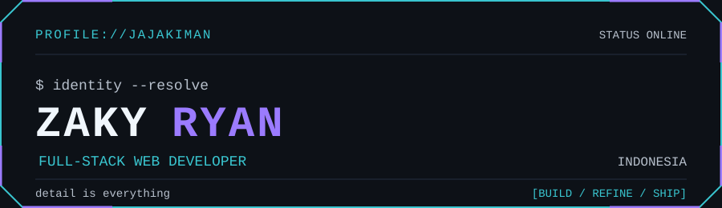

<div align="center">
  
</div>

<p align="center">
  <a href="#whoami">[whoami]</a>&nbsp;&nbsp;
  <a href="#stack">[stack]</a>&nbsp;&nbsp;
  <a href="#selected-work">[selected work]</a>&nbsp;&nbsp;
  <a href="#contact">[contact]</a>
</p>

## whoami

```console
$ whoami
Zaky Ryan. Full-stack web developer based in Indonesia.
```

I work across product interfaces, server-side logic, and the data behind them.

## stack

<p>
  
  
  
  
  
  
  
  
</p>

## selected work

| Project | What it is | Stack | Links |
| --- | --- | --- | --- |
| **CocokIn** | A marketplace-oriented web platform. Project Lead and Full Stack Developer. | Next.js, React, TypeScript, PostgreSQL, Prisma | [repository](https://github.com/jajakiman/CocokIn) · [live site](https://cocok-in-git-dev-zakyryan0-4528s-projects.vercel.app/) |
| **SDN Danabhakti** | A school profile website and content management system. | Next.js, TypeScript, Prisma, Neon PostgreSQL, Vercel Blob | [repository](https://github.com/jajakiman/COMPANY-PROFILE-SDN-DANABHAKTI) · [live site](https://sdn-danabhakti.vercel.app/) |
| **TUBES-CLOUD-COMPUTING** | TypeScript project repository. | TypeScript | [repository](https://github.com/jajakiman/TUBES-CLOUD-COMPUTING) |
| **BACKEND-SG-TEAM-10** | Backend team project repository. | JavaScript | [repository](https://github.com/jajakiman/BACKEND-SG-TEAM-10) |

<details>
  <summary><strong>$ open field-notes</strong></summary>

  <br />

  Public work includes TypeScript, JavaScript, PHP, Python, and Blade repositories. The selected projects above focus on full-stack web work; the complete list stays available on the [repositories tab](https://github.com/jajakiman?tab=repositories).
</details>

## contact

```console
$ connect --channel public
```

[GitHub](https://github.com/jajakiman) · [LinkedIn](https://www.linkedin.com/in/zakyryan/)

<sub>detail is everything</sub>
